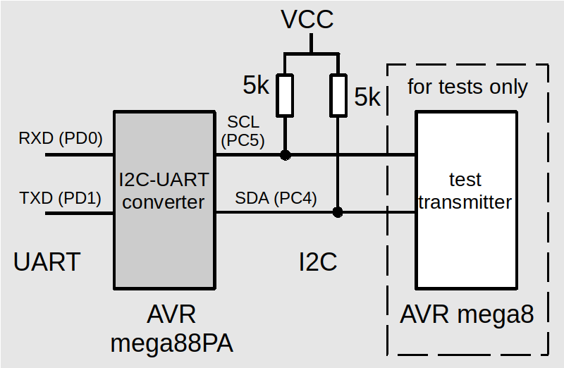

# I2C - UART converter on AVR mega88 + test I2C transmitter

I2C-UART converter for 2-way communication between UART and I2C devices.

Parameters:

* UART: 38400 bps, 8 bits, 1 stop bit, buffer 256 bytes,
* I2C: CLK max 100 kHz, buffer 256 bytes,
* default I2C addresses (defined in in ```i2c-uart-conv.h```):
	- for receiving 0x03 (SLA_ADR),
	- for sending 0x0A (RECEIVER_ADR),
* clock source: internal RC oscilator, 8 MHz.

For tests use e.g. another AVR microcontroller with code included in ```test-transmitter```.



Test transmitter sends 1000 lines of numbers + ASCII low letters + end of line ```\n```, e.g.:

```5015---abcdefghijklmnopqrstuvwxyz```

```5016---abcd*fghijklmnopqrstuvwxyz```

```5017---abcdefghijklmnopqrstuvwxyz```

```5018---ab*defghijklmnopqrstuvwxyz```

```5019---abcdefghijklmnopqrstuvwxyz```

```5020---*bcdefghijklmnopqrstuvwxyz```

after that it stops for 2 seconds and continues.

When the receiving buffer of the converter is full converter sends NACK and test transmitter changes the next character into ```*```.

After receiving NACK the I2C sender should stop transmission for the while. In ```test-transmitter``` it waits for 10ms after every NACK.

For programming use:

* make flash (default programmer: jtag3isp + avrdude)
* make lfuse (low fuse byte)
* make hfuse (high fuse byte)

## Links

* [avr-libc](https://www.nongnu.org/avr-libc/user-manual/index.html)
* [AVR ATmega88 datasheet](https://ww1.microchip.com/downloads/en/DeviceDoc/ATmega48_88_168_megaAVR-Data-Sheet-40002074.pdf)

## License

This project is licensed under the MIT License.

## Authors

* **Krzysztof Zurek** - [kz](https://github.com/KrzysztofZurek1973)
